  - [{ggwipe}: print the last plot and remove stat/geom/annotate layers
    in one
    step](#ggwipe-print-the-last-plot-and-remove-statgeomannotate-layers-in-one-step)
      - [You can specify the specific layer, with the `index = n`
        argument](#you-can-specify-the-specific-layer-with-the-index--n-argument)
      - [You can also use it for backtracking - removing the most recent
        layer with
        `last_plot_wipe_last()`.](#you-can-also-use-it-for-backtracking---removing-the-most-recent-layer-with-last_plot_wipe_last)
  - [Curious about implementation? Details about building these
    functions](#curious-about-implementation-details-about-building-these-functions)
  - [Step 0. Status quo, manually removing
    layers](#step-0-status-quo-manually-removing-layers)
  - [Step 0.b removing a specific
    layer.](#step-0b-removing-a-specific-layer)
  - [put it in a function:
    `last_plot_wipe`](#put-it-in-a-function-last_plot_wipe)
      - [Try it out.](#try-it-out)
  - [A convenience function,
    last\_plot\_wipe\_last](#a-convenience-function-last_plot_wipe_last)
      - [Try it](#try-it)
  - [Other work](#other-work)
  - [Part 2. Packaging and documentation 🚧
    ✅](#part-2-packaging-and-documentation--)
      - [minimal requirements for github package. Have
        you:](#minimal-requirements-for-github-package-have-you)
          - [Created files for package archetecture with
            `devtools::create("./ggbarlabs")`
            ✅](#created-files-for-package-archetecture-with-devtoolscreateggbarlabs-)
          - [Moved functions R folder? ✅](#moved-functions-r-folder-)
          - [Added roxygen skeleton? ✅](#added-roxygen-skeleton-)
          - [Managed dependencies ? ✅](#managed-dependencies--)
          - [Chosen a license? ✅](#chosen-a-license-)
          - [Run `devtools::check()` and addressed errors? 🚧 🚧 🚧 🚧
            🚧](#run-devtoolscheck-and-addressed-errors-----)
      - [Listen 🚧](#listen-)
          - [Consulted with technical experts
            🚧](#consulted-with-technical-experts-)
          - [Consulted with potential users
            🚧](#consulted-with-potential-users-)
      - [Polish. Have you.](#polish-have-you)
          - [Settled on examples and put them in the roxygen skeleton?
            🚧](#settled-on-examples-and-put-them-in-the-roxygen-skeleton-)
          - [Written formal tests of functions?
            🚧](#written-formal-tests-of-functions-)
          - [Sent tests in this readme to package via readme2pkg
            🚧](#sent-tests-in-this-readme-to-package-via-readme2pkg-)
          - [Have you worked added a description and author information
            in the DESCRIPTION file?
            🚧](#have-you-worked-added-a-description-and-author-information-in-the-description-file-)
          - [Addressed *all* notes, warnings and errors.
            🚧](#addressed-all-notes-warnings-and-errors-)
      - [Promote](#promote)
          - [Package website built? 🚧](#package-website-built-)
          - [Package website deployed? 🚧](#package-website-deployed-)
      - [Harden](#harden)
          - [Submit to CRAN? 🚧](#submit-to-cran-)
  - [Reports, Environment](#reports-environment)
      - [Description file extract](#description-file-extract)
      - [Environment](#environment)
      - [`devtools::check()` report](#devtoolscheck-report)

<!-- README.md is generated from README.Rmd. Please edit that file -->

# {ggwipe}: print the last plot and remove stat/geom/annotate layers in one step

<!-- badges: start -->

<!-- badges: end -->

In general ggplot2 lets you work in very fluid ways, including undoing
your work. For example facet\_null() and aes(fill = NULL) are moves that
allow you to ‘undo’ your faceting and fill decisions.

However, when it comes to layers, ggplot2 itself does not allow you to
remove stat/geom/annotation layers dynamically.

ggwipe::last\_plot\_wipe() lets you remove all layers or specified
layers from the ‘last plot’.

There are other approaches to this problem which I summarize in the
other work section. The difference between ggwipe::last\_plot\_wipe()
and these approaches is that last\_plot\_wipe doesn’t require you to
save out your plot as an object. Instead it favors a more exploratory
work flow, so uses ggplot2::last\_plot() retrieve the last plot,
modifies it by removing layers as specified, before it’s returned back
to the user for presentation or further manipulation.

``` r
library(tidyverse, warn.conflicts = F)
library(ggwipe)
mtcars %>% 
  ggplot() + 
  aes(am, fill = factor(vs)) +
  geom_bar()

last_plot_wipe() + 
  geom_bar(position = "fill")
```

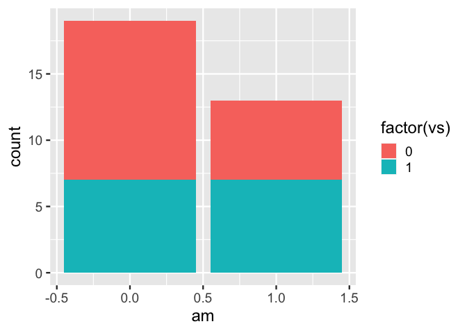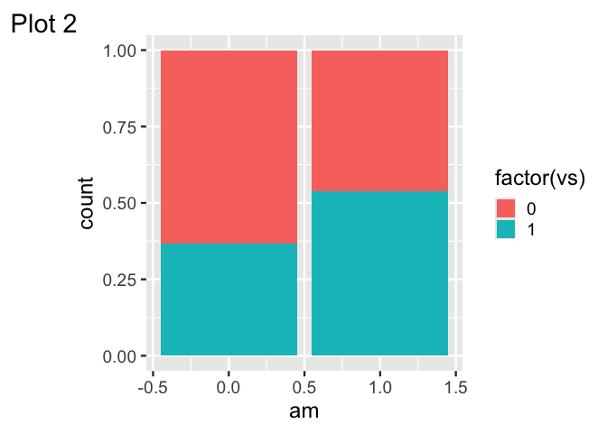

``` r
mtcars %>% 
  ggplot() + 
  aes(am, fill = factor(vs)) +
  geom_bar()

last_plot_wipe() + 
  aes(fill = NULL, 
      y = vs) + 
  geom_count()

last_plot_wipe() 
#> Error in plot$scales$clone(): attempt to apply non-function
```

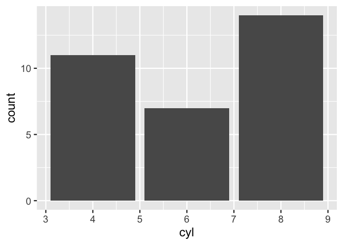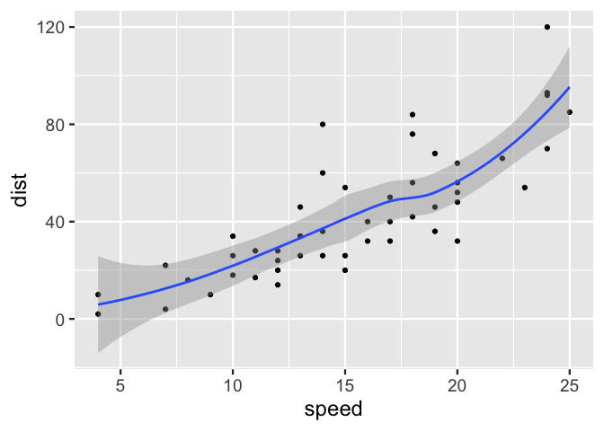

## You can specify the specific layer, with the `index = n` argument

``` r
ggplot(data = cars) + 
  aes(x = speed, y = dist) + 
  geom_rug() + 
  geom_point() + 
  geom_smooth()
#> `geom_smooth()` using method = 'loess' and formula = 'y ~ x'

last_plot_wipe(index = 1)  # removes rug
#> `geom_smooth()` using method = 'loess' and formula = 'y ~ x'
```

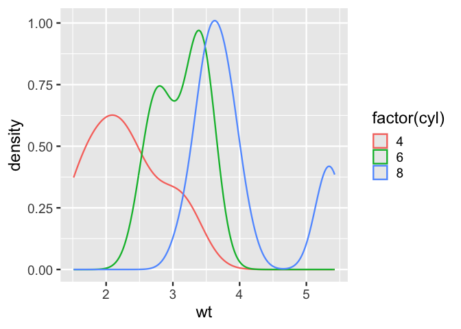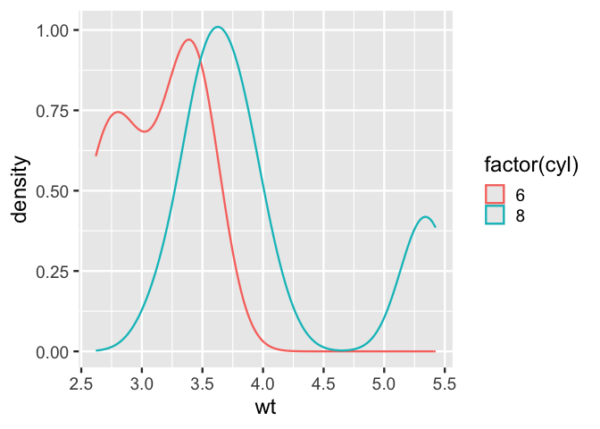

## You can also use it for backtracking - removing the most recent layer with `last_plot_wipe_last()`.

This function automatically detects the last layer.

``` r
ggplot(data = cars) + 
  aes(x = speed, y = dist) + 
  geom_rug() + 
  geom_point() + 
  geom_smooth()
#> `geom_smooth()` using method = 'loess' and formula = 'y ~ x'

last_plot_wipe_last()
last_plot_wipe_last()
last_plot_wipe_last()
```

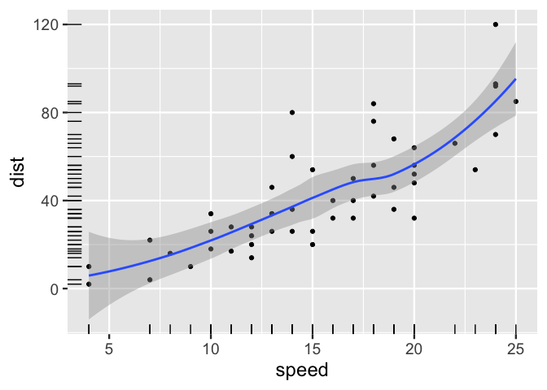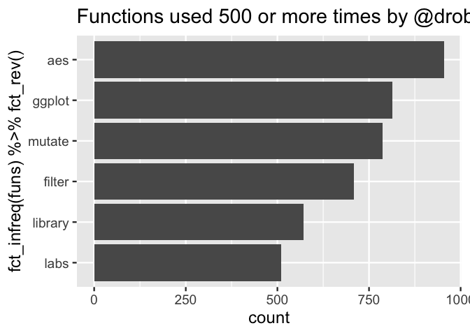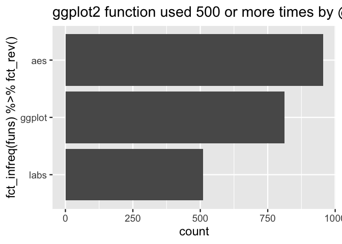

# Curious about implementation? Details about building these functions

# Step 0. Status quo, manually removing layers

``` r
p <- mtcars %>% 
  ggplot() + 
  aes(am, fill = factor(vs) ) +
  geom_bar()

p
```

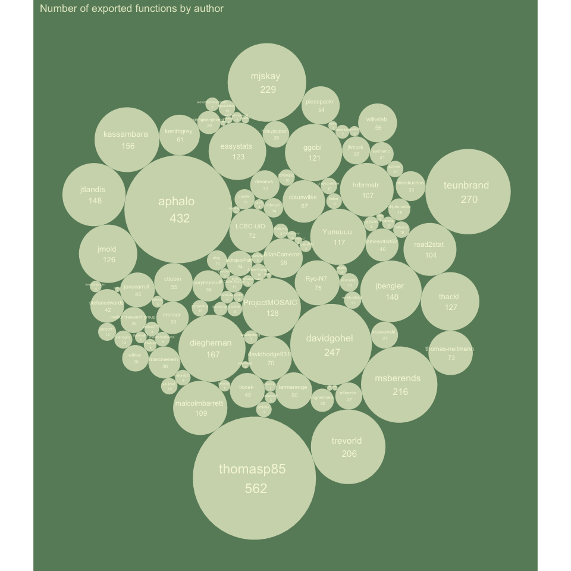<!-- -->

``` r

p[[2]] <- NULL # removes all layers specification

p
```

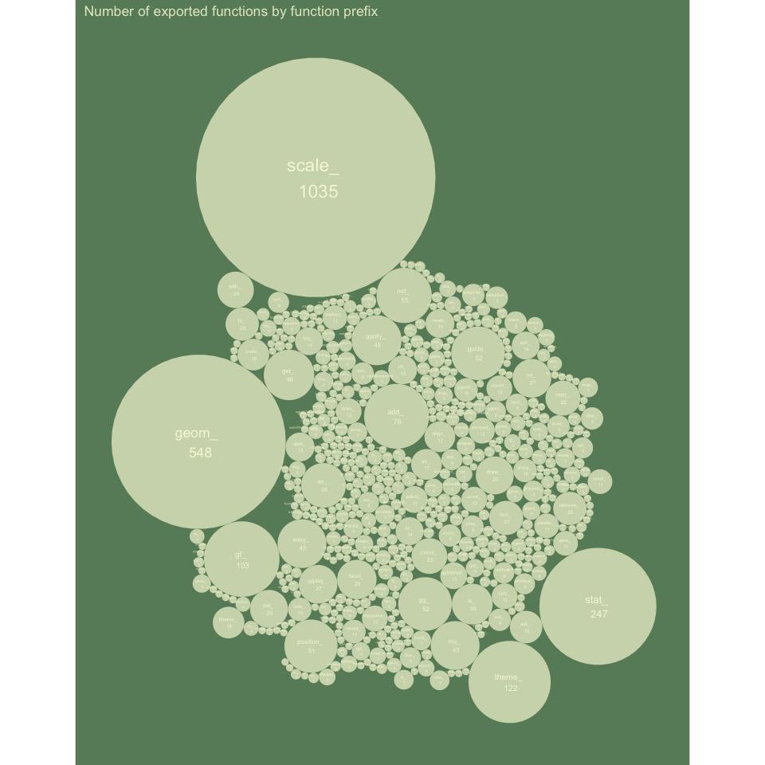<!-- -->

``` r

last_plot() + 
  geom_bar(position = "fill")
```

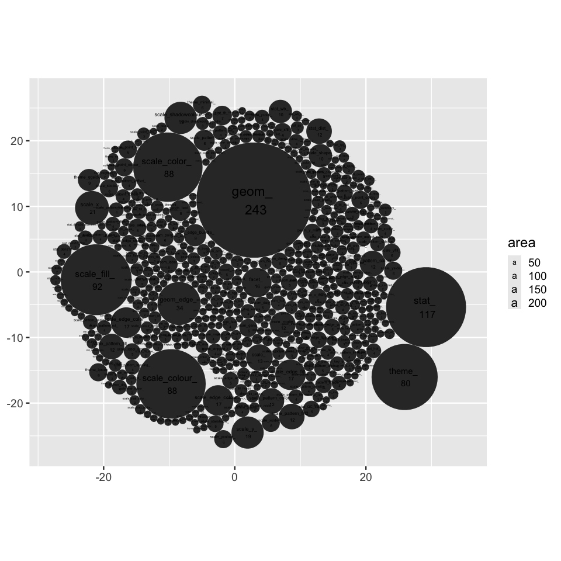<!-- -->

# Step 0.b removing a specific layer.

``` r
p <- mtcars %>% 
  ggplot() + 
  aes(am, fill = factor(vs) ) +
  geom_bar() + 
  stat_count(geom = "point", size = 14) + 
  stat_count(geom = "label", aes(label = after_stat(count)))

p
```

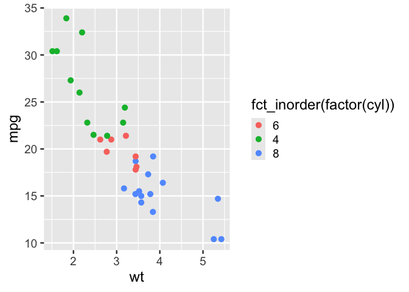<!-- -->

``` r

p[[2]][[2]] <- NULL # removes second layer specification

p
```

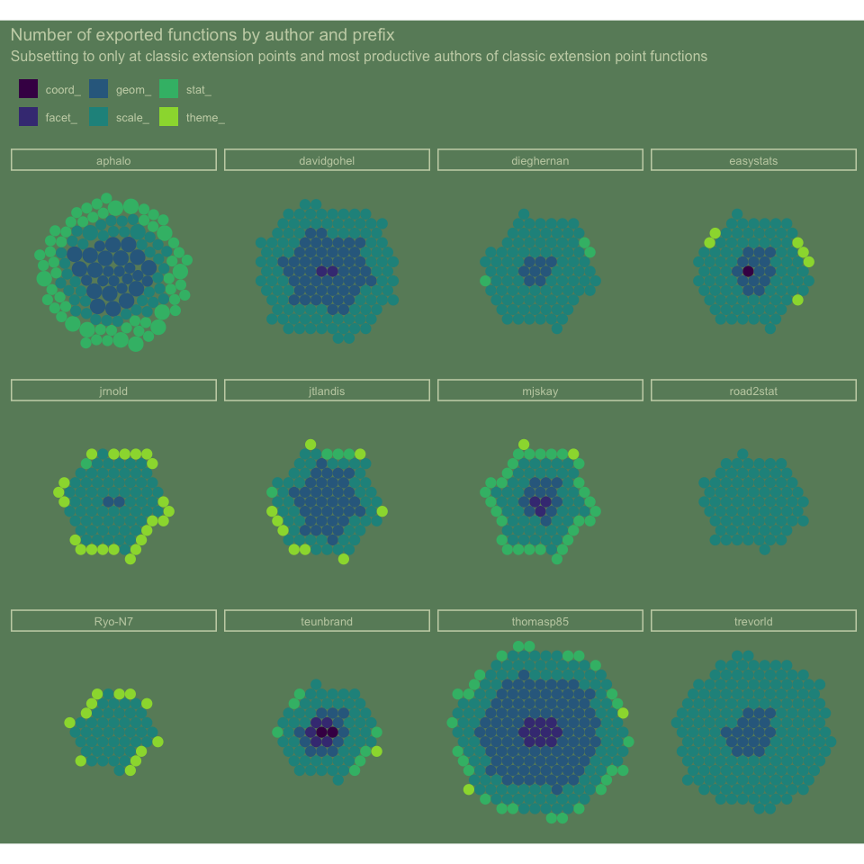<!-- -->

# put it in a function: `last_plot_wipe`

``` r
#' Title
#'
#' @param index 
#'
#' @return
#' @export
#'
#' @examples
last_plot_wipe <- function(index = NULL){
  
  
  p <- ggplot2::last_plot()
  
  # removes all layers specification
  if(is.null(index)){ p[[2]] <- NULL }else{p[[2]][[index]] <- NULL}
  
  return(p)
  
}
```

## Try it out.

``` r
mtcars %>% 
  ggplot() + 
  aes(am, fill = factor(vs)) +
  geom_bar()
```

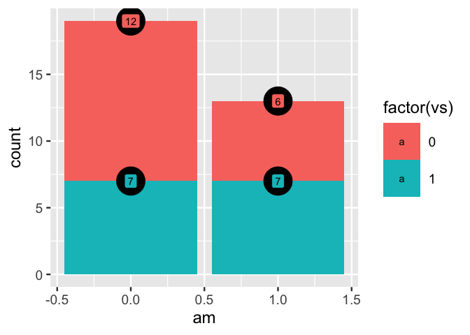<!-- -->

``` r

last_plot_wipe() + 
  geom_bar(position = "fill")
```

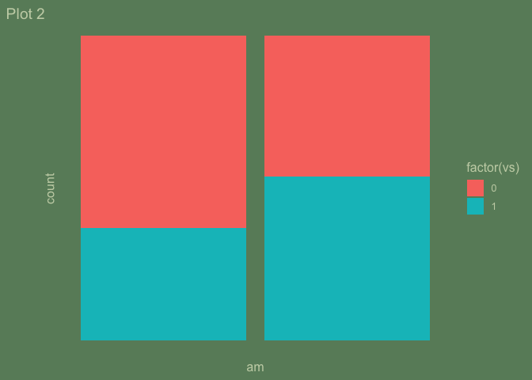<!-- -->

``` r


mtcars %>% 
  ggplot() + 
  aes(am, fill = factor(vs) ) +
  geom_bar() + 
  stat_count(geom = "point", size = 14) + 
  stat_count(geom = "label", aes(label = after_stat(count)))
```

<!-- -->

``` r

last_plot_wipe(index = 2)
```

<!-- -->

# A convenience function, last\_plot\_wipe\_last

To only wipe the final layer

``` r
#' Title
#'
#' @return
#' @export
#'
#' @examples
last_plot_wipe_last <- function(){
  
  
  p <- ggplot2::last_plot()
  
  index <- length(p[[2]])
  
  # removes all layers specification
  p[[2]][[index]] <- NULL
  
  return(p)
  
}
```

## Try it

``` r
mtcars %>% 
  ggplot() + 
  aes(am, fill = factor(vs) ) +
  geom_bar() + 
  stat_count(geom = "point", size = 14) + 
  stat_count(geom = "label", aes(label = after_stat(count)))
```

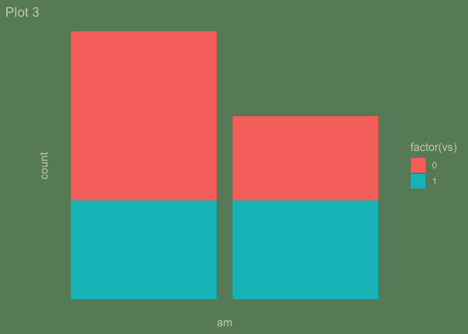<!-- -->

``` r

last_plot_wipe_last()
```

<!-- -->

# Other work

I think the difference is that other work would have you save the
ggplot2 object and then manipulate it, where as ggwipe lends itself to
printing the ggplot2 object and then retrieving and printing without a
new layer in one step.

  - gghost
  - pedro alpho
  - Jonathan Sidi

# Part 2. Packaging and documentation 🚧 ✅

## minimal requirements for github package. Have you:

### Created files for package archetecture with `devtools::create("./ggbarlabs")` ✅

### Moved functions R folder? ✅

``` r
knitr::knit_code$get() |> names()
#>  [1] "unnamed-chunk-1"     "unnamed-chunk-2"     "unnamed-chunk-3"    
#>  [4] "unnamed-chunk-4"     "unnamed-chunk-5"     "unnamed-chunk-6"    
#>  [7] "unnamed-chunk-7"     "last_plot_wipe"      "unnamed-chunk-8"    
#> [10] "last_plot_wipe_last" "unnamed-chunk-9"     "unnamed-chunk-10"   
#> [13] "unnamed-chunk-11"    "unnamed-chunk-12"    "unnamed-chunk-13"   
#> [16] "unnamed-chunk-14"    "unnamed-chunk-15"    "unnamed-chunk-16"   
#> [19] "unnamed-chunk-17"
```

``` r
readme2pkg::chunk_to_r(c("last_plot_wipe", 
                         "last_plot_wipe_last"))
```

### Added roxygen skeleton? ✅

for auto documentation and making sure proposed functions are *exported*

### Managed dependencies ? ✅

package dependancies managed, i.e. `depend::function()` in proposed
functions and declared in the DESCRIPTION

``` r
usethis::use_package("ggplot2")
```

### Chosen a license? ✅

``` r
usethis::use_mit_license()
```

### Run `devtools::check()` and addressed errors? 🚧 🚧 🚧 🚧 🚧

## Listen 🚧

### Consulted with technical experts 🚧

### Consulted with potential users 🚧

Getting started with that\!

## Polish. Have you.

### Settled on examples and put them in the roxygen skeleton? 🚧

### Written formal tests of functions? 🚧

### Sent tests in this readme to package via readme2pkg 🚧

That would look like this…

    chunk_to_tests_testthat("test_geom_barlab_count")

### Have you worked added a description and author information in the DESCRIPTION file? 🚧

### Addressed *all* notes, warnings and errors. 🚧

## Promote

### Package website built? 🚧

### Package website deployed? 🚧

## Harden

### Submit to CRAN? 🚧

# Reports, Environment

## Description file extract

## Environment

Here I just want to print the packages and the versions

``` r
all <- sessionInfo() |> print() |> capture.output()
all[11:17]
#> [1] ""                                                                            
#> [2] "attached base packages:"                                                     
#> [3] "[1] stats     graphics  grDevices utils     datasets  methods   base     "   
#> [4] ""                                                                            
#> [5] "other attached packages:"                                                    
#> [6] " [1] ggwipe_0.0.0.9000 lubridate_1.9.2   forcats_1.0.0     stringr_1.5.0    "
#> [7] " [5] dplyr_1.1.0       purrr_1.0.1       readr_2.1.4       tidyr_1.3.0      "
```

## `devtools::check()` report

``` r
# rm(list = c("geom_barlab_count", "geom_barlab_count_percent"))
devtools::check(pkg = ".")
```
