- [build functionality using the ggplot_add extension
  mechanism…](#build-functionality-using-the-ggplot_add-extension-mechanism)
- [explore extension exported
  functions…](#explore-extension-exported-functions)
- [{ggwipe}: print the last plot and remove stat/geom/annotate layers in
  one
  step](#ggwipe-print-the-last-plot-and-remove-statgeomannotate-layers-in-one-step)
  - [You can specify the specific layer, with the `index = n`
    argument](#you-can-specify-the-specific-layer-with-the-index--n-argument)
  - [You can also use it for backtracking - removing the most recent
    layer with
    `last_plot_wipe_last()`.](#you-can-also-use-it-for-backtracking---removing-the-most-recent-layer-with-last_plot_wipe_last)
- [Curious about implementation? Details about building these
  functions](#curious-about-implementation-details-about-building-these-functions)
- [Step 0. Status quo, ‘plot’ w/ no layers, or manually removing
  layers](#step-0-status-quo-plot-w-no-layers-or-manually-removing-layers)
- [Step 0.b removing a specific
  layer.](#step-0b-removing-a-specific-layer)
- [put it in a function:
  `last_plot_wipe`](#put-it-in-a-function-last_plot_wipe)
  - [Try it out.](#try-it-out)
- [A convenience function,
  last_plot_wipe_last](#a-convenience-function-last_plot_wipe_last)
  - [Try it](#try-it)
- [Other work](#other-work)
- [Part 2. Packaging and documentation 🚧
  ✅](#part-2-packaging-and-documentation--)
  - [minimal requirements for github package. Have
    you:](#minimal-requirements-for-github-package-have-you)
    - [Created files for package archetecture with
      `devtools::create("./ggbarlabs")`
      ✅](#created-files-for-package-archetecture-with-devtoolscreateggbarlabs-)
    - [Moved functions R folder? ✅](#moved-functions-r-folder-)
    - [Added roxygen skeleton? ✅](#added-roxygen-skeleton-)
    - [Managed dependencies ? ✅](#managed-dependencies--)
    - [Chosen a license? ✅](#chosen-a-license-)
    - [Run `devtools::check()` and addressed errors? 🚧 🚧 🚧 🚧
      🚧](#run-devtoolscheck-and-addressed-errors-----)
  - [Listen 🚧](#listen-)
    - [Consulted with technical experts
      🚧](#consulted-with-technical-experts-)
    - [Consulted with potential users
      🚧](#consulted-with-potential-users-)
  - [Polish. Have you.](#polish-have-you)
    - [Settled on examples and put them in the roxygen skeleton?
      🚧](#settled-on-examples-and-put-them-in-the-roxygen-skeleton-)
    - [Written formal tests of functions?
      🚧](#written-formal-tests-of-functions-)
    - [Sent tests in this readme to package via readme2pkg
      🚧](#sent-tests-in-this-readme-to-package-via-readme2pkg-)
    - [Have you worked added a description and author information in the
      DESCRIPTION file?
      🚧](#have-you-worked-added-a-description-and-author-information-in-the-description-file-)
    - [Addressed *all* notes, warnings and errors.
      🚧](#addressed-all-notes-warnings-and-errors-)
  - [Promote](#promote)
    - [Package website built? 🚧](#package-website-built-)
    - [Package website deployed? 🚧](#package-website-deployed-)
  - [Harden](#harden)
    - [Submit to CRAN? 🚧](#submit-to-cran-)
- [Reports, Environment](#reports-environment)
  - [Description file extract](#description-file-extract)
  - [Environment](#environment)
  - [`devtools::check()` report](#devtoolscheck-report)

<!-- README.md is generated from README.Rmd. Please edit that file -->

# build functionality using the ggplot_add extension mechanism…

<https://evamaerey.github.io/mytidytuesday/2024-07-10-ggnewdata/ggnewdata.html>

``` r
data_filter <- function(keep, .by) {
  structure(list(keep_specification = rlang::enquo(keep), 
                 by_specification = rlang::enquo(.by)), 
            class = "wipeobs")
}

ggplot_add.wipeobs <- function(object, plot, object_name, .by) {
  
  new_data <- dplyr::filter(plot$data, 
                            !! object$keep_specification, 
                            .by = !! object$by_specification)
  plot$data <- new_data
  plot

  }
```

``` r
library(tidyverse)
ggplot(cars) + 
  aes(dist, speed) + 
  geom_point(size = 7) + 
  aes(color = speed) + 
  scale_color_viridis_c(limits = c(0,26)) + 
  scale_x_continuous(limits = c(0,125)) +
  scale_y_continuous(limits = c(0,25))
```

<!-- -->

``` r
last_plot() + 
  data_filter(keep = dist > 60)
```

<!-- -->

``` r

tidytitanic::tidy_titanic |>
  ggplot() + 
  aes(x = sex) + 
  geom_bar()
```

<!-- -->

``` r

last_plot() + 
  data_filter(n() > 500, .by = sex)
```

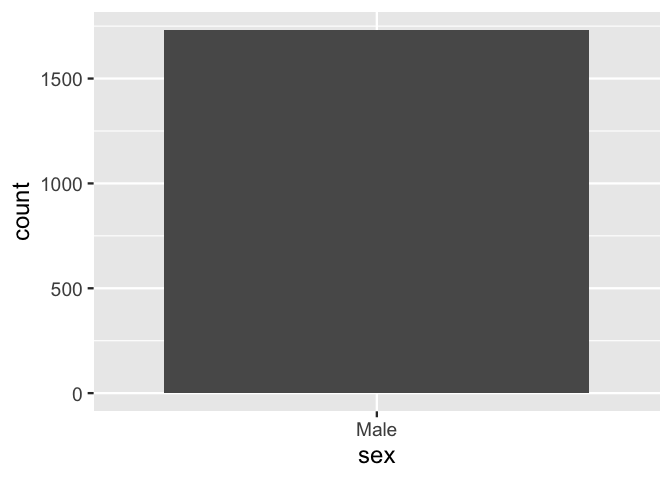<!-- -->

``` r

last_plot() + 
  aes(fill = age) 
```

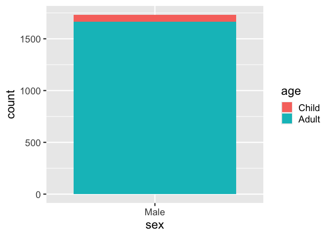<!-- -->

``` r

last_plot() + 
  data_filter(n() > 1000, .by = age)
```

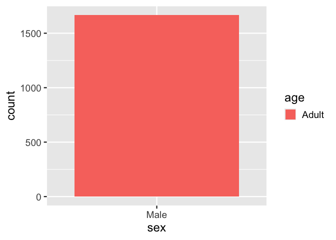<!-- -->

``` r
ggplot(cars) + 
  aes(dist, speed) + 
  geom_point(size = 7) + 
  aes(color = speed)
```

<!-- -->

``` r

data_replace <- function(data) {
  structure(list(new_data_specification = data), 
            class = "data_replace")
}

ggplot_add.data_replace <- function(object, plot, object_name) {
  
  plot$data <- object$new_data_specification
  plot

  }


last_plot() + 
  data_replace(data = cars %>% filter(dist > 50))
```

<!-- -->

``` r


drob_funs <- readr::read_csv('https://raw.githubusercontent.com/rfordatascience/tidytuesday/master/data/2024/2024-07-09/drob_funs.csv')


drob_funs %>% 
  ggplot() + 
  aes(y = funs) + 
  aes(y = fct_infreq(funs)) +
  aes(y = fct_infreq(funs) %>% fct_rev()) +
  geom_bar() ->
p; p
```

<!-- -->

``` r

p + 
  data_filter(n() > 500, 
              .by = funs)
```

<!-- -->

``` r

p + 
  data_filter(pkgs == "ggplot")
```

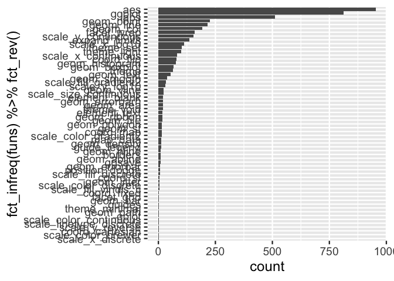<!-- -->

``` r


drob_funs <- readr::read_csv('https://raw.githubusercontent.com/rfordatascience/tidytuesday/master/data/2024/2024-07-09/drob_funs.csv')


data_mutate <- function(.value, .by, var_name) {
  structure(list(value_specification = rlang::enquo(.value),
                 by_specification = rlang::enquo(.by),
                 var_name_specification = var_name),
            class = "data_mutate")
  
}

ggplot_add.data_mutate <- function(object, plot, object_name) {

  
  new_data <- dplyr::mutate(plot$data, 
                            .value = !! object$value_specification, 
                            .by = !! object$by_specification)
  
    message("New variable named '.value' created")
    

    if(object$var_name %in% names(new_data)){
      
      new_data[,object$var_name] <- new_data$.value
      
      new_data <- new_data %>% select(-.value)
    }else{
    names(new_data)[names(new_data) == ".value"] <- object$var_name
    }
    
    
  plot$data <- new_data
  plot

  
}


drob_funs %>% 
  ggplot() + 
  aes(id = paste(pkgs, funs)) + 
  ggcirclepack::geom_circlepack() + 
  ggcirclepack::geom_circlepack_text(aes(label = funs)) + 
  coord_equal() +
  aes(fill = pkgs) + 
  guides(fill = "none")
```

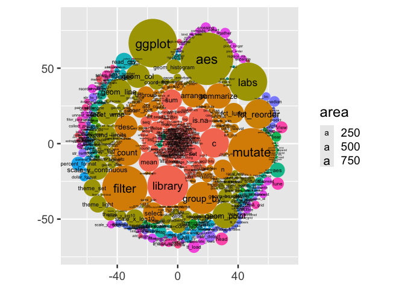<!-- -->

``` r

last_plot() +
  data_mutate(.value = n(), 
              .by = c(funs, pkgs), 
              var_name = "num"
              ) 
```

<!-- -->

``` r

last_plot() +
  data_filter(num >= 200)
```

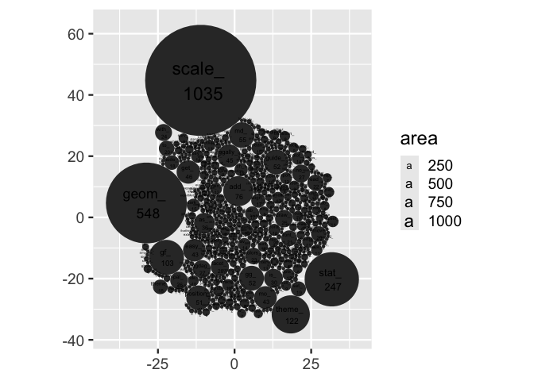<!-- -->

``` r

last_plot() +
  data_mutate(.value = case_when(funs == "ggplot" ~ "hello!",
                                     .default = funs), 
              var_name = "funs")
```

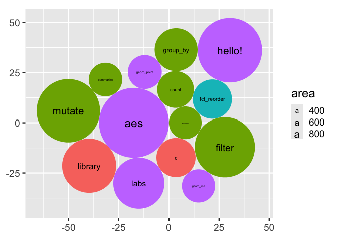<!-- -->

``` r


data_var_update <- function(.value, .by, var_name) {
  structure(list(value_specification = rlang::enquo(.value),
                 by_specification = rlang::enquo(.by),
                 var_name_specification = var_name),
            class = "data_var_update")
  
}

ggplot_add.data_var_update <- function(object, plot, object_name) {

  
  new_data <- dplyr::mutate(plot$data, 
                            .value = !! object$value_specification, 
                            .by = !! object$by_specification)
  
  new_data[names(new_data) == object$var_name] <- new_data$.value
    
    
  plot$data <- new_data
  plot

  
  }
```

# explore extension exported functions…

``` r
ext_exports <- read_csv("https://raw.githubusercontent.com/EvaMaeRey/mytidytuesday/refs/heads/main/2024-11-19-gg-prefixes/exported_funs_exts_ggplot2_tidyverse_org.csv") %>% 
  mutate(prefix = str_extract(fun_exported, ".*?_")) %>% 
  mutate(prefix_long = str_extract(fun_exported, ".+_")) %>% 
  mutate(ind_classic_prefix = prefix %in% c("stat_", "geom_", "theme_", "scale_", "coord_", "facet_"))


ext_exports %>% 
  ggplot() + 
  aes(id = user) + 
  ggcirclepack::geom_circlepack() + 
  ggcirclepack::geom_circlepack_text() +
  aes(label = after_stat(paste(id, "\n",area))) +
  coord_equal() + 
  theme_classic(ink = alpha("lightyellow",.8),
                paper = "darkseagreen4") + 
  theme(axis.text = element_blank()) + 
  theme(axis.line = element_blank(),
        axis.ticks = element_blank()) + 
  guides(size = "none") +
  labs(title = "Number of exported functions by author")
```

<!-- -->

``` r

(get_theme() + last_plot()$theme) |> theme_set()

last_plot() + 
  aes(id = prefix) + 
  labs(title = "Number of exported functions by function prefix")
```

<!-- -->

``` r


last_plot() + 
  data_filter(ind_classic_prefix) + 
  labs(subtitle = "Subsetting to only at classic extension points")
```

<!-- -->

``` r

last_plot() + 
  aes(id = prefix_long) + 
  labs(subtitle = "Subsetting to only classic extension points - number of functions by long prefix ...")
```

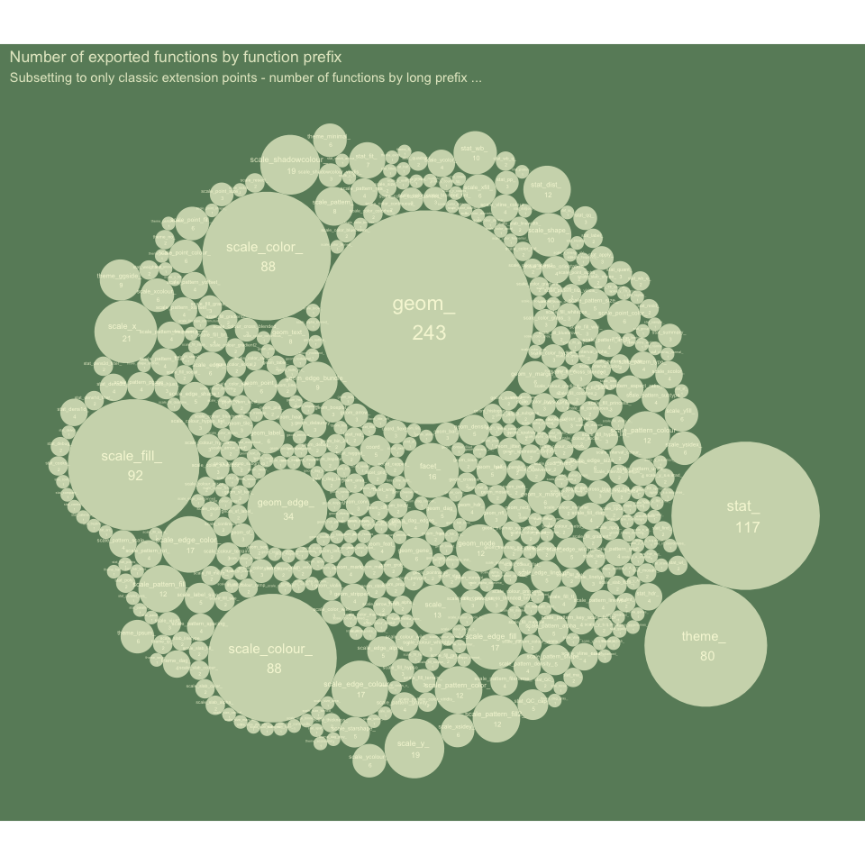<!-- -->

``` r
  
last_plot() + 
  aes(id = prefix) + 
  aes(fill = prefix) + 
  theme(legend.position = "top") + 
  theme(legend.justification = "left") +
  scale_fill_viridis_d(end = .85) + 
  labs(subtitle = "")
```

<!-- -->

``` r
  
  
last_plot() +
  aes(id = user) + 
  labs(title = "Number of exported functions by author and prefix",
       subtitle = "Subsetting to classic extension points") + 
  labs(fill = NULL) + 
  facet_wrap(~ prefix)
```

<!-- -->

``` r
last_plot() +  
  data_filter(n() > 50, .by = user) + 
  labs(subtitle = "Subsetting to only at classic extension points and most productive authors of classic extension point functions") +
  facet_wrap(~user) +
  aes(id = prefix) + 
  aes(fill = prefix) + 
  theme(legend.position = "none")
```

<!-- -->

``` r

last_plot() + 
  aes(group = paste0(repo, "::", fun_exported),
      label = "") + 
  theme(legend.position = "top")
```

<!-- -->

# {ggwipe}: print the last plot and remove stat/geom/annotate layers in one step

<!-- badges: start -->
<!-- badges: end -->

In general ggplot2 lets you work in very fluidly, including ‘undoing’
your work. For example facet_null() and aes(fill = NULL) are moves that
allow you to ‘undo’ your faceting and fill decisions.

However, when it comes to layers, ggplot2 itself does not allow you to
remove stat/geom/annotation layers dynamically.

ggwipe::last_plot_wipe() lets you remove all layers or specified layers
from the ‘last plot’.

There are other approaches to this problem which I summarize in the ‘see
also’ section. The difference between ggwipe::last_plot_wipe() and these
approaches is that last_plot_wipe doesn’t require you to save out your
plot as an object. Instead it favors a more exploratory work flow, so
uses ggplot2::last_plot() retrieve the last plot, modifies it by
removing layers as specified, before it’s returned back to the user for
presentation or further manipulation.

``` r
library(tidyverse, warn.conflicts = F)
library(ggwipe)
mtcars %>% 
  ggplot() + 
  aes(am, fill = factor(vs)) +
  geom_bar() +
  labs(tag = "Plot 1")

last_plot_wipe() + 
  geom_bar(position = "fill") +
  labs(tag = "Plot 2")
```


``` r
mtcars %>% 
  ggplot() + 
  aes(x = am, fill = factor(vs)) +
  geom_bar() +
  labs(tag = "Plot 3")

last_plot()$layers
#> $geom_bar
#> geom_bar: just = 0.5, na.rm = FALSE, orientation = NA
#> stat_count: na.rm = FALSE, orientation = NA
#> position_stack
```

``` r

last_plot_wipe() + 
  aes(y = vs, fill = NULL) + 
  geom_count() +
  labs(tag = "Plot 4")

last_plot()$layers
#> $geom_count
#> geom_point: na.rm = FALSE
#> stat_sum: na.rm = FALSE
#> position_identity
```

``` r

last_plot_wipe() + 
  geom_count(shape = 21)
#> Error in plot$scales$clone(): attempt to apply non-function
```

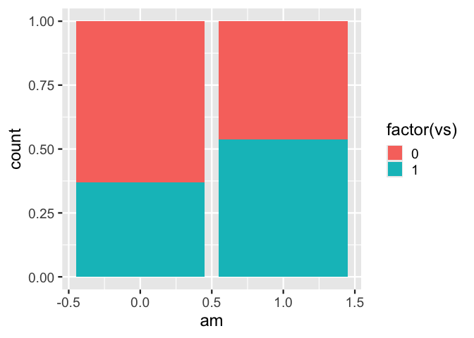

## You can specify the specific layer, with the `index = n` argument

``` r
ggplot(data = cars) + 
  aes(x = speed, y = dist) + 
  geom_rug() + # layer 1
  geom_point() + 
  geom_smooth()

last_plot_wipe(index = 1)  # removes rug
```

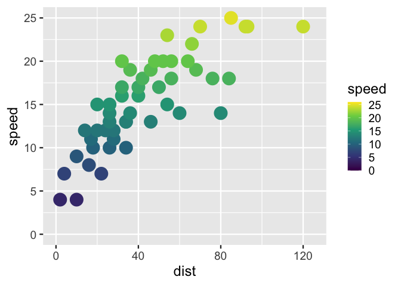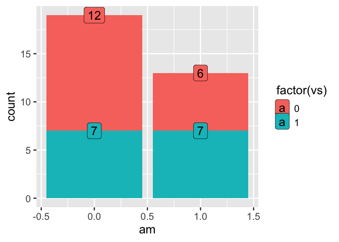

## You can also use it for backtracking - removing the most recent layer with `last_plot_wipe_last()`.

This function automatically detects the last layer.

``` r
ggplot(data = cars) + 
  aes(x = speed, y = dist) + 
  geom_rug() + 
  geom_point() + 
  geom_smooth()

last_plot_wipe_last()
last_plot_wipe_last()
last_plot_wipe_last()
```

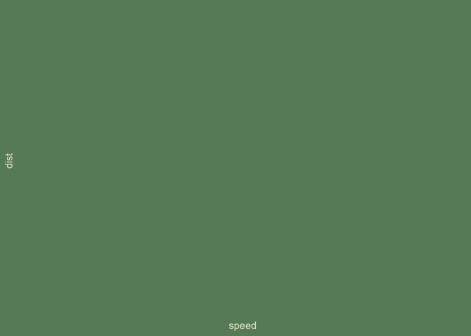

# Curious about implementation? Details about building these functions

# Step 0. Status quo, ‘plot’ w/ no layers, or manually removing layers

``` r
base_specifiction <- mtcars %>% 
  ggplot() + 
  aes(am, fill = factor(vs) )

base_specifiction + 
  geom_bar() 
```

<!-- -->

``` r

base_specifiction +
  geom_bar(position = "fill")
```

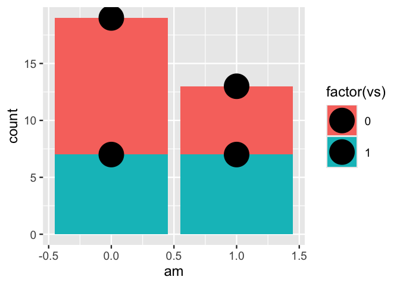<!-- -->

``` r

p <- mtcars %>% 
  ggplot() + 
  aes(am, fill = factor(vs) ) +
  geom_bar()

p
```

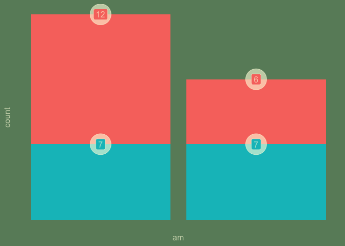<!-- -->

``` r

p$layers
#> $geom_bar
#> geom_bar: just = 0.5, na.rm = FALSE, orientation = NA
#> stat_count: na.rm = FALSE, orientation = NA
#> position_stack
```

``` r

p$layers <- NULL # removes all layers specification

p$layers
#> NULL
```

``` r

r <- p + 
  geom_bar(position = "fill")

r$layers
#> $geom_bar
#> geom_bar: just = 0.5, na.rm = FALSE, orientation = NA
#> stat_count: na.rm = FALSE, orientation = NA
#> position_fill
```

``` r

r
```

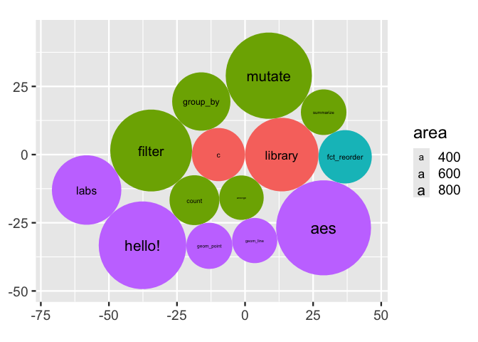<!-- -->

``` r

q <- mtcars %>% 
  ggplot() + 
  aes(am, fill = factor(vs) ) +
  geom_bar(position = "fill")

q$layers
#> $geom_bar
#> geom_bar: just = 0.5, na.rm = FALSE, orientation = NA
#> stat_count: na.rm = FALSE, orientation = NA
#> position_fill
```

# Step 0.b removing a specific layer.

``` r
p <- mtcars %>% 
  ggplot() + 
  aes(am, fill = factor(vs) ) +
  geom_bar() + 
  stat_count(geom = "point", size = 14) + 
  stat_count(geom = "label", aes(label = after_stat(count)))

p
```

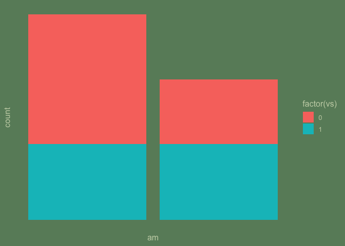<!-- -->

``` r

p$layers[[2]] <- NULL # removes second layer specification

p
```

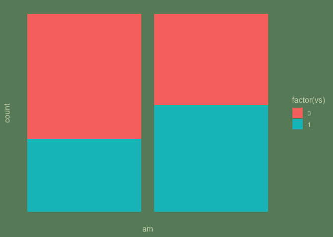<!-- -->

# put it in a function: `last_plot_wipe`

``` r
#' Title
#'
#' @param index 
#'
#' @return
#' @export
#'
#' @examples
last_plot_wipe <- function(index = NULL){
  
  
  p <- ggplot2::last_plot()
  
  # removes all layers specification
  if(is.null(index)){ p$layers <- NULL }else{p$layers[[index]] <- NULL}
  
  return(p)
  
}
```

## Try it out.

``` r
mtcars %>% 
  ggplot() + 
  aes(am, fill = factor(vs)) +
  geom_bar()
```

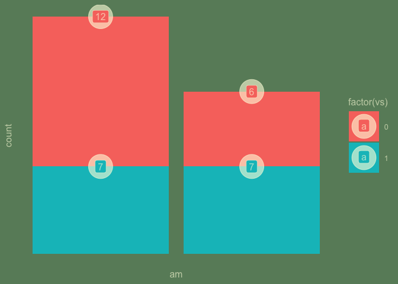<!-- -->

``` r

last_plot_wipe() + 
  geom_bar(position = "fill")
```

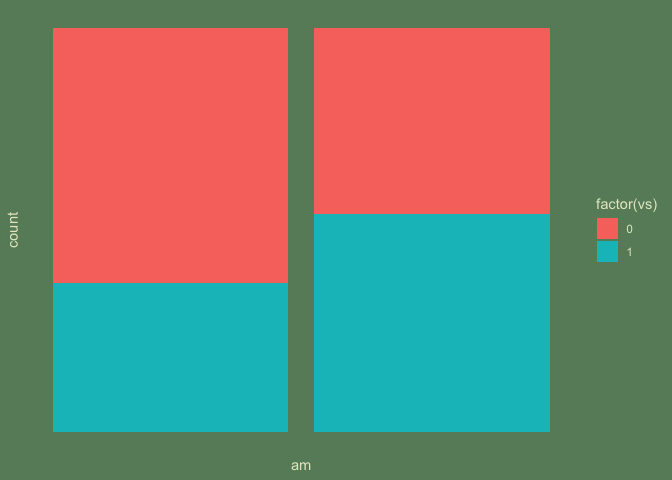<!-- -->

``` r


mtcars %>% 
  ggplot() + 
  aes(am, fill = factor(vs) ) +
  geom_bar() + 
  stat_count(geom = "point", size = 14) + 
  stat_count(geom = "label", aes(label = after_stat(count)))
```

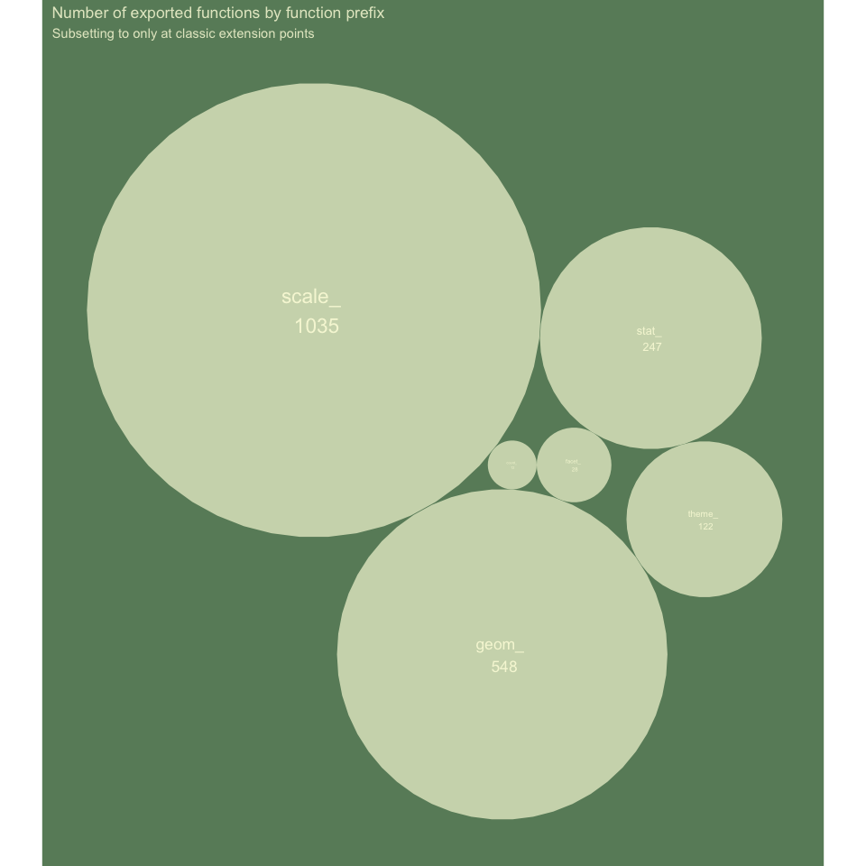<!-- -->

``` r

last_plot_wipe(index = 2)
```

<!-- -->

# A convenience function, last_plot_wipe_last

To only wipe the final layer

``` r
#' Title
#'
#' @return
#' @export
#'
#' @examples
last_plot_wipe_last <- function(){
  
  
  p <- ggplot2::last_plot()
  
  index <- length(p$layers)
  
  # removes all layers specification
  p$layers[[index]] <- NULL
  
  return(p)
  
}
```

## Try it

``` r
mtcars %>% 
  ggplot() + 
  aes(am, fill = factor(vs) ) +
  geom_bar() + 
  stat_count(geom = "point", size = 14) + 
  stat_count(geom = "label", aes(label = after_stat(count)))
```

<!-- -->

``` r

last_plot_wipe_last()
```

<!-- -->

# Other work

I think the difference is that other work would have you save the
ggplot2 object and then manipulate it, where as ggwipe lends itself to
printing the ggplot2 object and then retrieving and printing without a
new layer in one step.

- gghost Jonathan Carroll
- pedro alpho
- Jonathan Sidi ggedit

# Part 2. Packaging and documentation 🚧 ✅

## minimal requirements for github package. Have you:

### Created files for package archetecture with `devtools::create("./ggbarlabs")` ✅

### Moved functions R folder? ✅

``` r
knitr::knit_code$get() |> names()
#>  [1] "unnamed-chunk-1"     "unnamed-chunk-2"     "unnamed-chunk-3"    
#>  [4] "unnamed-chunk-4"     "unnamed-chunk-5"     "unnamed-chunk-6"    
#>  [7] "unnamed-chunk-7"     "unnamed-chunk-8"     "unnamed-chunk-9"    
#> [10] "unnamed-chunk-10"    "unnamed-chunk-11"    "unnamed-chunk-12"   
#> [13] "unnamed-chunk-13"    "unnamed-chunk-14"    "last_plot_wipe"     
#> [16] "unnamed-chunk-15"    "last_plot_wipe_last" "unnamed-chunk-16"   
#> [19] "unnamed-chunk-17"    "unnamed-chunk-18"    "unnamed-chunk-19"   
#> [22] "unnamed-chunk-20"    "unnamed-chunk-21"    "unnamed-chunk-22"   
#> [25] "unnamed-chunk-23"    "unnamed-chunk-24"
```

``` r
knitrExtra:::chunk_to_r(c("last_plot_wipe", 
                         "last_plot_wipe_last"))
```

### Added roxygen skeleton? ✅

for auto documentation and making sure proposed functions are *exported*

### Managed dependencies ? ✅

package dependancies managed, i.e. `depend::function()` in proposed
functions and declared in the DESCRIPTION

``` r
usethis::use_package("ggplot2")
```

### Chosen a license? ✅

``` r
usethis::use_mit_license()
```

### Run `devtools::check()` and addressed errors? 🚧 🚧 🚧 🚧 🚧

## Listen 🚧

### Consulted with technical experts 🚧

### Consulted with potential users 🚧

Getting started with that!

## Polish. Have you.

### Settled on examples and put them in the roxygen skeleton? 🚧

### Written formal tests of functions? 🚧

### Sent tests in this readme to package via readme2pkg 🚧

That would look like this…

    chunk_to_tests_testthat("test_geom_barlab_count")

### Have you worked added a description and author information in the DESCRIPTION file? 🚧

### Addressed *all* notes, warnings and errors. 🚧

## Promote

### Package website built? 🚧

### Package website deployed? 🚧

## Harden

### Submit to CRAN? 🚧

# Reports, Environment

## Description file extract

## Environment

Here I just want to print the packages and the versions

``` r
all <- sessionInfo() |> print() |> capture.output()
all[11:17]
#> [1] ""                                                                         
#> [2] "time zone: America/Denver"                                                
#> [3] "tzcode source: internal"                                                  
#> [4] ""                                                                         
#> [5] "attached base packages:"                                                  
#> [6] "[1] stats     graphics  grDevices utils     datasets  methods   base     "
#> [7] ""
```

## `devtools::check()` report

``` r
# rm(list = c("geom_barlab_count", "geom_barlab_count_percent"))
devtools::check(pkg = ".")
```
